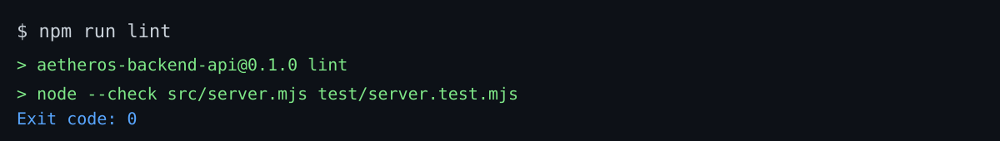
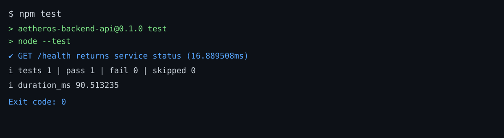
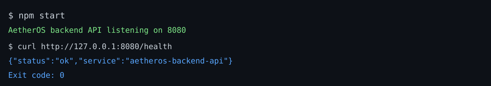

# AetherOS

AetherOS is an Android desktop operating platform focused on modular architecture, cross-platform UX, and extensibility.

## Repository Structure

- `/desktop` - Desktop shell, window manager, dock, widgets, settings, and UX systems
- `/android` - Android companion app and device-side modules
- `/backend` - Platform service APIs and orchestration services
- `/cloud` - Authentication, sync, AI, and backup cloud services
- `/sdk` - SDKs for plugins, widgets, themes, AI skills, automation, and CLI tools
- `/plugins` - First-party and community plugin workspace
- `/themes` - Built-in and custom theme packs
- `/docs` - Architecture, roadmap, security, testing, and operations documentation
- `/installer` - Platform-specific installers and packaging assets
- `/website` - Product and documentation website workspace
- `/design-system` - Shared design tokens and component guidelines
- `/shared` - Shared models, protocols, constants, and utilities

## Starter Implementations Added

- Desktop shell executable starter (Flutter):
  - `/home/runner/work/AetherOS/AetherOS/desktop/shell/flutter_app`
- Android companion app starter (Android/Kotlin):
  - `/home/runner/work/AetherOS/AetherOS/android/app/companion`
- Backend API starter with tests (Node.js):
  - `/home/runner/work/AetherOS/AetherOS/backend/api/service`
- Shared protocol contracts starter:
  - `/home/runner/work/AetherOS/AetherOS/shared/protocols/contracts`

## Quick Run Commands

### Backend API
```bash
cd /home/runner/work/AetherOS/AetherOS/backend/api/service
npm test
npm start
```

### Desktop Shell (requires Flutter SDK)
```bash
cd /home/runner/work/AetherOS/AetherOS/desktop/shell/flutter_app
flutter pub get
flutter run -d windows
```

### Android Companion (requires Android SDK + Java 17)
```bash
cd /home/runner/work/AetherOS/AetherOS/android/app/companion
gradle assembleDebug
```

## Project Output Results

### Backend API Lint Result


### Backend API Test Result


### Backend API Run Result

